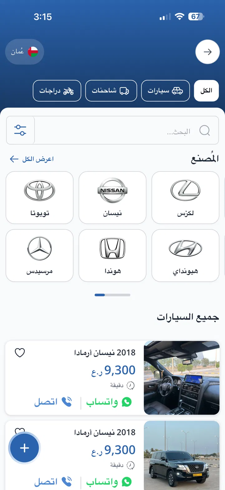
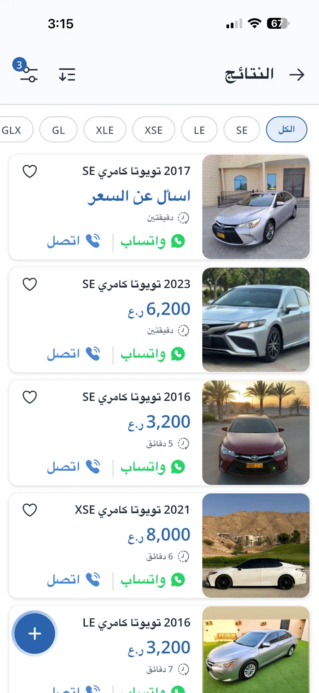
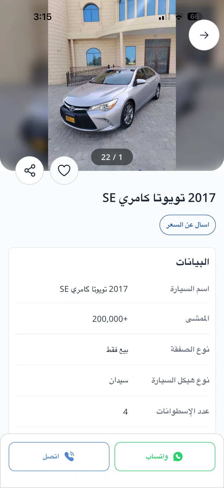
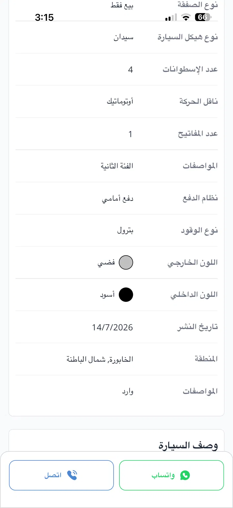

<div align="center">

# 🚗 AK Cars — Customer Mobile App

**Car services, parts, and a cars marketplace for the Sultanate of Oman.**

Built with Flutter · Riverpod · go_router — RTL-first, Arabic-native UI.

[](https://flutter.dev)
[](https://dart.dev)
[](https://riverpod.dev)
[](https://pub.dev/packages/go_router)
[](#)
[](#)

</div>

---

## 📸 Screenshots

<!-- <div align="center">

| Home / Marketplace | Search Results | Listing Detail | Full Specs |
|:---:|:---:|:---:|:---:|
|  |  |  |  |

</div> -->

---

## ✨ Features

- 🏁 **Onboarding** — splash, first-launch guide, and a "car now / car later" start choice.
- 🔐 **Registration gate** — phone or email OTP (phone always required) enforced before any transaction.
- 🛠️ **Service marketplace** — browse services by region and car, add-ons, provider capacity, mandatory Oman plate entry.
- 📦 **Escrow state machine** — ten states, one explicit transition table, three roles (customer, workshop, founder); proof → approve → release, with a 72-hour auto-release window, live tracking, call, and chat.
- 🧰 **Operator panels** — a workshop panel (accept, start, submit proof) and a founder panel (confirm funds held, resolve disputes), reachable after switching role in Settings.
- 🚙 **Cars marketplace** *(phase 2 — hidden behind `AppFlags.carMarketplaceEnabled`)* — browse, filter by make/model, view detailed listings and specs, post an ad.
- 🛒 **Parts shop** *(phase 2 — hidden behind `AppFlags.partsStoreEnabled`)* — free filters (car, category, provider, price, region), cart, and orders.
- 🚗 **My Garage** — save cars (petrol, diesel, hybrid, plug-in or electric), manage favorites.
- ⚡ **Built for EV owners too** — record a car's powertrain and the app follows it: EV maintenance without oil reminders, EV-certified workshops, charging parts, and an EV weekly challenge.
- 👤 **Profile hub** — requests, payments, and account.

---

## 🚀 Getting Started

**Prerequisites:** [Flutter SDK](https://docs.flutter.dev/get-started/install) `^3.12.2`.

```bash
flutter pub get      # install dependencies
flutter run          # launch on a connected device / emulator
```

> **Demo tip:** during registration, any 4-digit OTP works (e.g. `7391`).

---

## 🏗️ Architecture

| Concern | Approach |
|---|---|
| **State** | Riverpod — `lib/data/app_state.dart` (auth/registration gate, garage, service requests, cart, shop filters, favorites) |
| **Navigation** | go_router — `lib/core/router/app_router.dart` — `StatefulShellRoute` bottom-nav shell + pushed detail routes; `ensureRegistered()` enforces the transaction gate |
| **Design system** | `lib/core/theme/` — tokens from the approved HTML designs (brand `#1D4ED8`, ink `#0F172A`, 20px cards, Plus Jakarta Sans) |
| **Data** | `lib/data/mock_data.dart` — a stand-in for the AK Cars API; models mirror backend concepts (ServiceRequest lifecycle, escrow states, provider fulfillment capacity) |

### Project layout

```
lib/
├── core/
│   ├── router/      # go_router configuration
│   ├── theme/       # colors, theme, design tokens
│   ├── utils/       # contact helpers
│   └── widgets/     # shared widgets (car media, Oman plate input)
├── data/            # app state, models, mock data, catalogs, locations
├── features/
│   ├── onboarding/  # splash, guide, start choice
│   ├── auth/        # registration + OTP gate
│   ├── home/        # home + notifications
│   ├── services/    # detail, booking, tracking, escrow approval, chat
│   ├── cars/        # marketplace, filters, results, listing detail, post ad
│   ├── garage/      # my cars, add car
│   ├── shop/        # shop, filters, cart, orders
│   ├── profile/     # profile hub, payments
│   └── shell/       # bottom-nav shell
└── main.dart
```

---

## 🗺️ Roadmap

- **Phase 1 — booking → escrow → approval** (current): four tabs
  (الخدمات · حجوزاتي · سيارتي · حسابي), the escrow state machine, maintenance
  follow-up, mock data. The parts store and the cars marketplace are hidden
  behind feature flags, not removed — `lib/config/app_flags.dart`.
- **Phase 2 — API integration:** wire screens to the AK Cars ASP.NET API (OTP, capacity, add-ons, chat, FCM).
- **Phase 3 — Real escrow:** Thawani-backed payment escrow.

See `MobileApp-Design/PROJECT_PLAN.md` §8 for the full plan.

---

## 🧰 Tech Stack

`flutter_riverpod` · `go_router` · `google_fonts` · `intl` · `url_launcher` · `collection`

---

<div align="center">

**AK Cars** · Oman 🇴🇲 · Private repository

</div>
